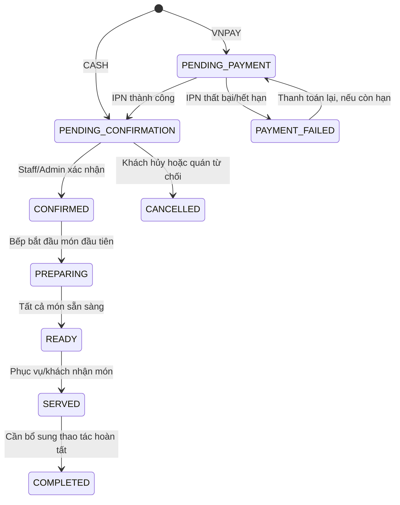
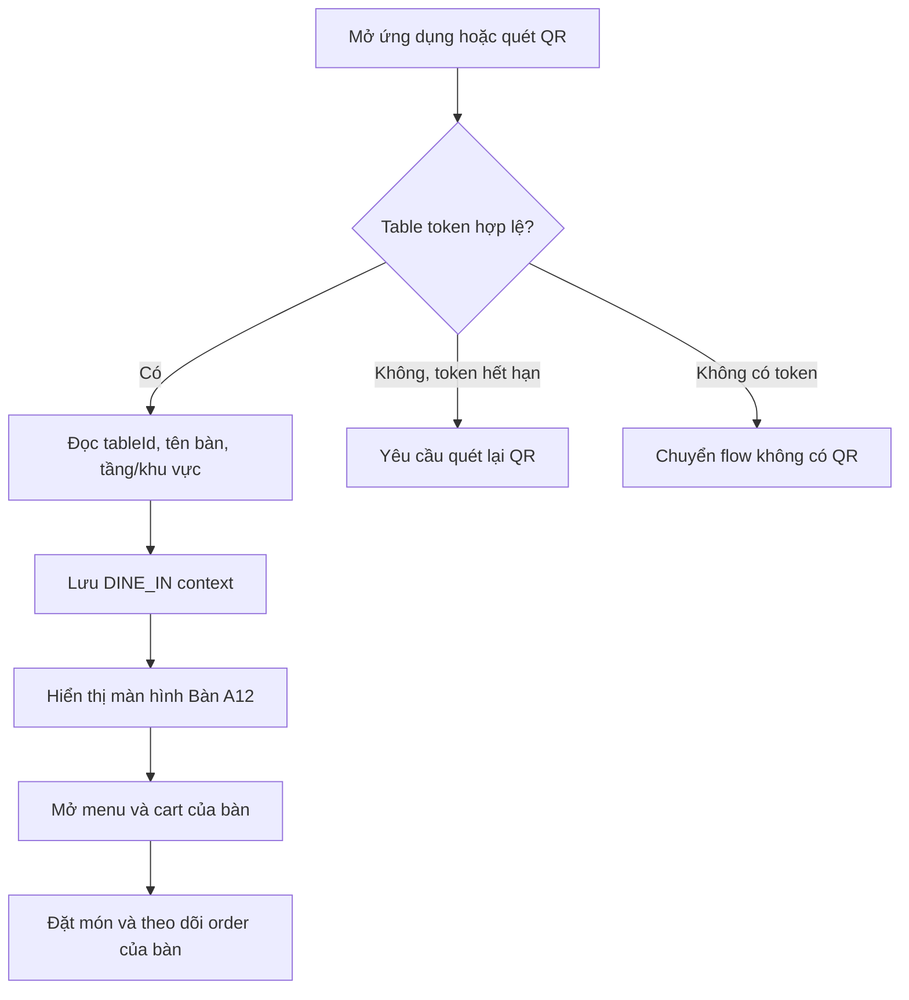

# Phân tích đặt hàng, role và đặc tả UX FoodHub

> Tài liệu này được tổng hợp từ toàn bộ mã nguồn trong `src/`, kết hợp đối chiếu các model Prisma cần thiết. Phần **Hiện trạng** mô tả hành vi đang có trong code; phần **Đề xuất** là hướng thiết kế sản phẩm và giao diện nên triển khai.

## 1. Tóm tắt điều hành

FoodHub hiện có ba ngữ cảnh đặt hàng:

- **DINE_IN**: khách quét QR bàn, cart dùng chung theo `tableId`.
- **TAKEAWAY**: khách đặt mang về, cart theo `X-Session-Id`, user ID hoặc fallback IP.
- **DELIVERY**: khách phải đăng nhập, cart theo user ID.

Ba role chính:

- **CUSTOMER**: xem menu, quản lý cart, đặt delivery, xem đơn của mình, hủy đơn ở trạng thái chờ xác nhận, đánh giá món.
- **STAFF**: vận hành đơn, xác nhận/từ chối/phục vụ đơn, xử lý hàng bếp, xác nhận thanh toán tiền mặt.
- **ADMIN**: toàn bộ quyền STAFF và quản trị menu, category, variant, bàn, QR, flash sale.

Ưu tiên thiết kế trải nghiệm theo thứ tự:

1. Chọn đúng ngữ cảnh đặt hàng ngay từ đầu và luôn hiển thị ngữ cảnh đó.
2. Cho người dùng biết đơn đang ở bước nào, bước kế tiếp là gì và ai đang xử lý.
3. Ẩn thao tác không thuộc role hoặc trạng thái hiện tại, thay vì để người dùng gặp lỗi API.
4. Thiết kế cả trạng thái lỗi, hết món, thanh toán chờ, mạng chập chờn và phiên QR hết hạn.

## 2. Bản đồ mã nguồn và trách nhiệm

| Khu vực | Trách nhiệm chính | File tiêu biểu |
|---|---|---|
| Context/auth | Xác thực user, table token, context đặt hàng | [auth.middlewares.ts](../src/middlewares/auth.middlewares.ts), [order.middlewares.ts](../src/middlewares/order.middlewares.ts), [cart.middlewares.ts](../src/middlewares/cart.middlewares.ts) |
| Cart | Cart Redis theo loại đơn và owner | [carts.services.ts](../src/services/carts.services.ts), [cart.routes.ts](../src/routes/cart.routes.ts) |
| Tạo đơn | Đọc cart, snapshot món, tính tiền, tạo payment | [order.controllers.ts](../src/controllers/order.controllers.ts) |
| Workflow đơn | Lịch sử, kitchen queue, confirm/reject/serve, trạng thái item | [orders.services.ts](../src/services/orders.services.ts), [orders.routes.ts](../src/routes/orders.routes.ts) |
| Thanh toán | VNPay, IPN, tiền mặt | [payment.controllers.ts](../src/controllers/payment.controllers.ts), [payments.services.ts](../src/services/payments.services.ts) |
| Menu/bàn | Menu public, quản trị món, table QR/session | [menu.routes.ts](../src/routes/menu.routes.ts), [tables.routes.ts](../src/routes/tables.routes.ts) |
| Realtime/chat | Cập nhật đơn, bếp, hỗ trợ hội thoại | [order.socket.ts](../src/socket/orders/order.socket.ts), [conversation.socket.ts](../src/socket/chat/conversation.socket.ts) |
| Notification | Thông báo MongoDB theo recipient và order | [notifications.services.ts](../src/services/notifications.services.ts) |

## 3. Các case đặt hàng

### 3.1. Dine-in qua QR bàn

**Luồng hiện tại**

1. Khách mở QR và tạo table session trong Redis, TTL 8 giờ.
2. Client gửi `X-Table-Token` khi gọi cart/order và khi kết nối Socket.IO.
3. Cart được lưu theo `cart:dine-in:{tableId}`; nhiều người trong cùng bàn có thể dùng chung cart.
4. Tạo đơn không bắt buộc user login.
5. Đơn tiền mặt vào `PENDING_CONFIRMATION`; đơn VNPay vào `PENDING_PAYMENT`.
6. Staff/admin xác nhận, bếp chuyển món qua `PREPARING` và `READY`, sau đó staff/admin phục vụ.

**UX nên có**

- Header luôn hiển thị `Bàn A12`, tầng/khu vực và trạng thái phiên.
- Màn hình menu có nút “Gọi món cho bàn”, số lượng món trong cart dùng chung.
- Cho phép thêm món tiếp theo sau khi đơn trước đã được xác nhận; hiện backend đang chặn khi bàn còn đơn `PENDING_PAYMENT` hoặc `PENDING_CONFIRMATION`.
- Hiển thị banner rõ ràng khi table session hết hạn: “Phiên bàn đã hết hạn, quét lại QR”.
- Sau khi đặt: hiển thị timeline `Đã gửi -> Quán xác nhận -> Đang chuẩn bị -> Sẵn sàng -> Đã phục vụ`.
- Nút “Gọi nhân viên” hoặc chat nên gắn với bàn và phiên hiện tại, tránh đặt trong menu gây nhầm với đặt món.

**Ngoại lệ cần thiết kế**

- QR không hợp lệ hoặc bàn không tồn tại.
- Bàn đang có đơn chờ xác nhận.
- Món vừa hết hoặc bị tắt trong lúc checkout.
- Nhiều người cùng sửa cart; frontend cần refresh cart sau khi nhận event/server response.

### 3.2. Takeaway

**Luồng hiện tại**

- Có thể đặt không login.
- Cart ưu tiên `X-Session-Id`, tiếp theo là user ID, cuối cùng là IP.
- Không có bước giao hàng; về nghiệp vụ cần xem đây là “đặt trước để nhận tại quầy”.
- Kitchen query có `pickupCode`, nhưng code hiện chưa sinh và chưa có API xác thực nhận món.

**UX nên có**

- Cho khách chọn “Nhận tại quầy”, nhập tên/số điện thoại tùy chính sách.
- Sau checkout hiển thị mã đơn lớn, pickup code nếu backend đã hỗ trợ và thời gian dự kiến.
- Trạng thái chính: `Đã nhận đơn -> Đã xác nhận -> Đang chuẩn bị -> Sẵn sàng nhận -> Đã nhận món`.
- Cho phép tra cứu đơn bằng `orderCode` hoặc session mà không buộc tạo tài khoản.
- Có nút “Thanh toán lại” nếu VNPay thất bại hoặc hết thời gian.

### 3.3. Delivery

**Luồng hiện tại**

- Bắt buộc đăng nhập và chỉ ADMIN/CUSTOMER được tạo cart/order.
- `deliveryInfo` đang nhận dưới dạng JSON tự do, chưa có schema bắt buộc.
- Chưa có transition `DELIVERING`, `DELIVERED` hoặc phí giao hàng; workflow hiện tại vẫn dùng trạng thái bếp/serve chung.

**UX nên có sau khi hoàn thiện backend**

- Form địa chỉ gồm người nhận, số điện thoại, địa chỉ, ghi chú giao hàng.
- Tóm tắt phí: tạm tính, VAT, phí giao hàng, giảm giá, tổng thanh toán.
- Chọn phương thức thanh toán và hiển thị rõ “Thanh toán trước” hay “Thanh toán khi nhận”.
- Timeline: `Chờ thanh toán -> Đã xác nhận -> Đang chuẩn bị -> Đang giao -> Đã giao`.
- Hiển thị vùng giao hàng, thời gian dự kiến và trạng thái tài xế nếu sau này tích hợp logistics.

### 3.4. Thanh toán

| Trường hợp | Trạng thái tạo đơn | Kết quả mong muốn trên UI |
|---|---|---|
| CASH | `PENDING_CONFIRMATION`, payment `UNPAID` | Đơn đã gửi, chờ quán xác nhận tiền mặt |
| VNPAY thành công | `PENDING_PAYMENT` rồi IPN chuyển `PENDING_CONFIRMATION` | Không coi redirect thành công là đủ; chờ IPN/API xác nhận |
| VNPAY thất bại | `PAYMENT_FAILED` | Cho thanh toán lại hoặc hủy đơn |
| MOMO | Enum có tồn tại nhưng controller chưa có workflow riêng | Tạm ẩn khỏi UI cho đến khi có tích hợp hoàn chỉnh |

Frontend phải xử lý trạng thái `payment_pending` độc lập với trang return của VNPay. Nếu người dùng đóng trình duyệt, mở lại app vẫn phải thấy đơn và có thể polling/retry lấy trạng thái.

## 4. State machine đề xuất cho giao diện



### Trạng thái hiện có và trạng thái còn thiếu

Đã có trong enum: `PENDING_PAYMENT`, `PENDING_CONFIRMATION`, `CONFIRMED`, `PREPARING`, `READY`, `SERVED`, `COMPLETED`, `CANCELLED`, `PAYMENT_FAILED`.

Cần bổ sung hoặc thống nhất cho delivery/takeaway:

- `DELIVERING`, `DELIVERED` hoặc quy ước rõ dùng `SERVED` cho nhận tại quầy.
- Sinh và xác thực `pickupCode`.
- Quy trình `COMPLETED`.
- Timeout/cancel tự động cho đơn VNPay quá hạn.
- Transition hợp lệ cho từng `OrderType`, không dùng một workflow chung cho mọi loại đơn.

## 5. Ma trận role và màn hình

| Tính năng | Customer | Staff | Admin | Giao diện đề xuất |
|---|---:|---:|---:|---|
| Xem menu/review | Có | Có | Có | Menu public, lọc category, món hết hàng không cho thêm |
| Dine-in | QR guest hoặc login | Có thể hỗ trợ | Có thể hỗ trợ | Table context, cart dùng chung, order timeline |
| Takeaway | Có | Có | Có | Pickup form, mã đơn, pickup status |
| Delivery | Có | Không nên đặt thay khách | Có thể hỗ trợ | Address checkout, phí giao, tracking |
| Xem lịch sử | Đơn của mình | Toàn bộ | Toàn bộ | Customer list cá nhân; staff/admin có filter theo ngày/trạng thái/bàn |
| Kitchen queue | Không | Có | Có | Kanban hoặc 3 cột `WAITING/PREPARING/READY`, thao tác lớn dễ chạm |
| Confirm/reject/serve | Hủy đơn của mình khi hợp lệ | Có | Có | Action theo trạng thái, bắt buộc lý do khi từ chối/hủy |
| Quản trị menu/variant | Không | Xem/toggle theo route hiện có | Có | Bảng món, availability switch, chỉnh giá/variant |
| Quản trị bàn/QR | Không | Không | Có | Sơ đồ bàn, trạng thái bàn, tạo/tái tạo QR |
| Thanh toán tiền mặt | Không | Có | Có | Nút xác nhận chỉ hiện khi payment `UNPAID` |
| Chat | Conversation của mình | Conversation được phân công/host | Toàn bộ | Inbox vận hành, unread badge, trạng thái online |

**Nguyên tắc RBAC trên UI**

- Role quyết định navigation và tập màn hình.
- Order status quyết định action bar trong chi tiết đơn.
- Không chỉ disable nút; cần giải thích ngắn khi action không khả dụng.
- Backend vẫn là nguồn quyết định cuối cùng. UI ẩn nút không thay thế kiểm tra quyền server.

## 6. Kiến trúc thông tin và màn hình nên xây

### Customer / Guest

1. **Menu**: context bàn/nhận tại quầy/giao hàng, category tabs, search, filter món còn hàng.
2. **Chi tiết món**: ảnh, giá thực tế, variant, ghi chú, allergen nếu có, nút thêm vào cart.
3. **Cart**: nhóm món theo variant/note, sửa nhanh số lượng, cảnh báo món thay đổi giá/hết hàng.
4. **Checkout**: loại đơn, thông tin giao/nhận, payment, phí và tổng tiền.
5. **Order tracking**: timeline, item status, payment status, mã đơn/pickup code, chat.
6. **Order history**: filter theo loại đơn/trạng thái/thời gian, reorder có kiểm tra availability.
7. **Reviews**: chỉ hiện CTA sau `SERVED`, đánh giá theo từng món.
8. **Notifications**: payment, confirmation, ready, cancellation; guest cần fallback bằng polling/order lookup.

### Staff

1. **Live order board**: ưu tiên đơn mới/chờ xác nhận, filter theo `DINE_IN/TAKEAWAY/DELIVERY`.
2. **Kitchen display**: item card lớn, màu trạng thái tiết chế, ghi chú món nổi bật, thao tác một chạm.
3. **Order detail**: bàn/pickup/address, payment badge, customer note, lịch sử status.
4. **Ready/serve board**: pickup code hoặc bàn, nút xác nhận đã giao món.
5. **Chat inbox**: hội thoại chưa nhận, đang xử lý, đã đóng.

### Admin

1. Dashboard vận hành: doanh thu, đơn theo trạng thái, món bán chạy, đơn lỗi thanh toán.
2. Menu management: category, item, variant, price, availability, image.
3. Table/QR management: bàn, floor, active session, generate/regenerate QR.
4. User/role management: active/inactive, role, audit log.
5. Reports: doanh thu và order history với filter, export sau này.

## 7. Checklist trạng thái và khả năng sử dụng

### Checkout

- Hiển thị tổng tiền từ server, không tự tin vào giá trong cart client.
- Chặn double-submit; hiển thị loading và giữ `orderCode`.
- Hỗ trợ retry an toàn bằng idempotency key.
- Cảnh báo cart đã thay đổi khi món không còn available.
- Form lỗi inline, focus vào field đầu tiên sai.
- Mobile-first: sticky summary và CTA checkout không che nội dung.

### Realtime và offline

- Socket event chỉ là tín hiệu cập nhật; luôn có API fetch làm nguồn khôi phục.
- Nếu socket mất, hiển thị “Đang kết nối lại” và polling backoff ở order tracking.
- Event cần có `updatedAt`/version để bỏ qua event đến trễ.
- Sau IPN VNPay và cash confirm cần emit order status để UI không bị treo ở trạng thái cũ.

### Accessibility và visual language

- Màu trạng thái phải đi kèm text/icon, không dùng màu đơn độc.
- Nút kitchen tối thiểu đủ lớn cho thao tác nhanh trên tablet.
- Focus state, keyboard navigation và contrast đạt WCAG AA.
- Không dùng card lồng card; dùng layout theo bảng/kanban cho vận hành và timeline cho khách.
- Mobile customer ưu tiên một cột; staff tablet ưu tiên board nhiều cột; admin desktop ưu tiên bảng dữ liệu.

## 8. Phát hiện kỹ thuật ảnh hưởng trực tiếp UX

### Mức P0/P1 nên xử lý trước frontend

1. **Bảo vệ payment**: `/payment/vnpay/create` và `GET /payment/:orderId` hiện chưa kiểm tra ownership.
2. **Bảo vệ upload**: route upload ảnh import auth nhưng chưa gắn middleware.
3. **Không trả `qrToken` qua table detail public**.
4. **Sửa occupied table**: không coi `CANCELLED` và `PAYMENT_FAILED` là đơn đang chiếm bàn.
5. **Chuẩn hóa cart/order type**: cart middleware đang kiểm tra enum trực tiếp, trong khi order middleware normalize nhiều dạng input.
6. **Validate checkout**: thêm schema cho payment method, `deliveryInfo`, variant và option thuộc đúng menu item.
7. **Tính giá đúng**: snapshot phải bao gồm sale price và giá cộng variant tại thời điểm đặt.
8. **Hoàn thiện delivery/takeaway**: pickup code, completed, delivery status, timeout VNPay.
9. **Đồng bộ auth**: kiểm tra `isActive` khi login/middleware, tránh chỉ tin role trong JWT.
10. **Sửa reset password**: `Promise.all` phải được `await` trước khi trả response.

### Mức P2

- Thêm idempotency và chống race condition cho cart/order/IPN.
- Giới hạn và validate pagination review.
- Emit notification qua socket hoặc quy định polling rõ ràng.
- Dọn table session khỏi Redis set khi hết hạn.
- Cho phép/không cho phép đặt thêm dine-in phải được chốt thành policy rõ ràng.
- Thêm audit log cho hành động staff/admin.

## 9. Kế hoạch triển khai đề xuất

### Giai đoạn 1: làm ổn định contract

- Chốt enum/status transition theo từng `OrderType`.
- Thêm schema checkout và xác thực ownership payment.
- Sửa quyền upload, QR token, active user và table occupancy.
- Viết contract test cho cart -> order -> payment -> kitchen.

### Giai đoạn 2: xây trải nghiệm customer

- Menu/context selector, cart, checkout.
- Order tracking có fallback polling.
- Payment pending/failed/retry.
- Guest order lookup cho dine-in/takeaway.

### Giai đoạn 3: xây màn hình vận hành

- Live order board và kitchen display.
- Ready/serve/pickup flow.
- Notification/chat inbox.
- Tablet accessibility và thao tác một chạm.

### Giai đoạn 4: admin và đo lường

- Menu/table/user management.
- Dashboard, audit log, report.
- Theo dõi funnel: add-to-cart, checkout failure, payment failure, preparation time, cancellation reason.

## 10. Tiêu chí nghiệm thu quan trọng

- Người dùng luôn biết mình đang đặt cho bàn nào, nhận tại quầy hay giao hàng.
- Không thể checkout bằng giá/variant đã cũ mà không được cảnh báo.
- Mỗi order status trên UI có đúng action hợp lệ cho role hiện tại.
- Refresh trang hoặc mất socket không làm mất khả năng theo dõi đơn.
- VNPay return, IPN trễ, IPN lặp và thanh toán thất bại đều cho kết quả nhất quán.
- Staff không thấy thao tác quản trị menu/bàn nếu không phải ADMIN.
- Guest vẫn xem được kết quả đơn dine-in/takeaway bằng session hoặc order code.
- Mọi lỗi phổ biến đều có thông báo thân thiện, hướng dẫn bước tiếp theo và không lộ thông tin nội bộ.

## 11. Flow khởi động và xác định context đặt hàng

### 11.1. Nguyên tắc quyết định

Ứng dụng không nên suy ra loại đơn chỉ từ trạng thái đăng nhập. Login chỉ xác định danh tính và quyền; context đặt hàng phải được xác định theo thứ tự ưu tiên sau:

```text
Table token hợp lệ
    -> DINE_IN
Không có table token
    -> User đã login: cho chọn DELIVERY hoặc TAKEAWAY
    -> Guest: TAKEAWAY hoặc yêu cầu login khi chọn DELIVERY
Table token có nhưng hết hạn/không hợp lệ
    -> Không dùng context cũ, yêu cầu quét lại QR
```

**QR bàn luôn có ưu tiên cao nhất**, kể cả khi user đã đăng nhập. User login trong phiên DINE_IN chỉ bổ sung thông tin tài khoản, lịch sử đơn và quyền review; không tự động chuyển context sang DELIVERY.

### 11.2. Màn hình khởi động

Khi mở ứng dụng, client kiểm tra song song:

- Table token/session trong storage và trạng thái token còn hạn.
- Access token và thông tin user hiện tại.
- Takeaway session ID đã lưu trên thiết bị.
- Context gần nhất, nhưng chỉ dùng làm gợi ý, không ghi đè table token hợp lệ.

Sau khi kiểm tra, ứng dụng đưa người dùng vào một trong các màn hình sau:

| Điều kiện | Context được chọn | Màn hình đầu tiên |
|---|---|---|
| Có table token hợp lệ | `DINE_IN` | Xác nhận bàn, sau đó mở menu của bàn |
| Có table token nhưng hết hạn | Chưa xác định | Thông báo quét lại QR |
| Không có QR, đã login | Chưa xác định | Chọn `DELIVERY` hoặc `TAKEAWAY` |
| Không có QR, chưa login | Guest | Chọn `TAKEAWAY` hoặc đăng nhập để dùng `DELIVERY` |
| Đang có context được lưu và còn hợp lệ | Context đã lưu | Mở lại menu của context đó, cho phép đổi context |

Trong lúc resolver đang chạy, hiển thị loading tối giản. Không hiển thị menu mặc định trước khi biết context, vì điều đó dễ làm cart bị ghi nhầm sang owner/context khác.

### 11.3. Flow có QR hợp lệ: DINE_IN



Màn hình xác nhận bàn nên hiển thị:

- Tên bàn, tầng và khu vực nếu có.
- Trạng thái phiên QR.
- Số món trong cart bàn.
- Các đơn đang hoạt động của bàn.
- CTA chính: `Xem thực đơn`.
- CTA phụ: `Quét lại QR` hoặc `Rời phiên bàn`.

Nếu user đã login, hiển thị tùy chọn “Đồng bộ đơn vào tài khoản”. Nếu guest, vẫn cho đặt món và theo dõi đơn bằng table session/order code.

### 11.4. Flow không có QR và đã login

Không nên tự động mặc định `DELIVERY`, vì user có thể đang muốn đặt trước để nhận tại quầy. Màn hình chọn loại đơn gồm hai lựa chọn rõ ràng:

```text
Bạn muốn nhận món theo cách nào?

[ Giao tận nơi ]
Đặt món đến địa chỉ của bạn

[ Nhận tại quầy ]
Đặt trước và nhận món tại nhà hàng
```

Sau khi chọn, client lưu context cục bộ:

```ts
type OrderingContext =
  | {
      type: 'DINE_IN'
      tableId: string
      sessionId: string
      tableName?: string
    }
  | {
      type: 'TAKEAWAY'
      sessionId: string
      userId?: string
    }
  | {
      type: 'DELIVERY'
      userId: string
    }
```

`DINE_IN` phải có table session hợp lệ; `DELIVERY` phải có user ID; `TAKEAWAY` có thể dùng user ID hoặc session ID.

### 11.5. Flow không login và không có QR

Guest được xem menu và đặt `TAKEAWAY`. Khi vào flow này, client tạo một UUID ổn định cho thiết bị và gửi qua `X-Session-Id`.

```text
Guest mở app
    -> Chọn Nhận tại quầy
    -> Tạo takeaway session ID
    -> Xem menu và quản lý cart
    -> Checkout: tên/số điện thoại nếu chính sách yêu cầu
    -> Nhận orderCode và pickupCode
    -> Tra cứu/tracking đơn bằng session hoặc orderCode
```

Khi guest chọn `DELIVERY`, hiển thị màn hình yêu cầu đăng nhập/đăng ký. Sau khi login thành công, giữ lại cart TAKEAWAY hiện tại và hỏi user có muốn chuyển sang DELIVERY hay không; không tự động chuyển cart hoặc loại đơn.

Không nên dùng IP làm định danh cart guest. Nhiều người dùng có thể dùng chung IP, khiến cart bị dùng nhầm. Backend nên yêu cầu `X-Session-Id` cho guest takeaway và tạo session mới nếu header không hợp lệ.

### 11.6. Context switcher và bảo vệ cart

Header luôn hiển thị context hiện tại:

- `Bàn A12` cho DINE_IN.
- `Nhận tại quầy` cho TAKEAWAY.
- `Giao tận nơi` cho DELIVERY.

Context switcher cho phép:

- DINE_IN -> `Rời phiên bàn`, sau đó chọn TAKEAWAY/DELIVERY.
- TAKEAWAY <-> DELIVERY nếu cart hiện tại rỗng.
- Nếu cart không rỗng, hiển thị lựa chọn `Giữ cart hiện tại`, `Chuyển món sang context mới` hoặc `Hủy`.
- Khi quét QR mới, hiển thị xác nhận chuyển từ bàn cũ sang bàn mới.

Mỗi context phải có cart riêng:

```text
cart:dine-in:{tableId}
cart:takeaway:{sessionId hoặc userId}
cart:delivery:{userId}
```

Không được âm thầm trộn cart giữa các context. Trước khi đổi context, client phải tải lại cart từ server và xác nhận server đã nhận đúng context.

### 11.7. Navigation theo context

**DINE_IN**

```text
Bàn A12
├── Thực đơn
├── Cart của bàn
├── Đơn của bàn
├── Gọi nhân viên
└── Chat hỗ trợ
```

**TAKEAWAY**

```text
Nhận tại quầy
├── Thực đơn
├── Cart
├── Đơn của tôi
├── Tra cứu đơn
└── Pickup code
```

**DELIVERY**

```text
Giao tận nơi
├── Thực đơn
├── Cart
├── Địa chỉ giao hàng
├── Đơn của tôi
└── Địa chỉ đã lưu
```

### 11.8. Quy tắc backend/frontend dùng chung

1. Frontend dùng resolver để chọn màn hình; backend vẫn xác minh table token, user, role và context ở mọi request.
2. Table token hợp lệ luôn được ưu tiên hơn access token khi xác định loại đơn.
3. Table token hết hạn phải trả lỗi rõ ràng và không được fallback âm thầm sang takeaway/delivery.
4. `DELIVERY` yêu cầu login; `TAKEAWAY` cho phép guest; `DINE_IN` yêu cầu table token.
5. Context được lưu ở client chỉ là cache UX, không phải nguồn xác thực.
6. Khi refresh trang, giữ context hợp lệ và khôi phục đúng cart tương ứng.
7. Khi socket disconnect, giữ context và dùng API/polling để khôi phục trạng thái order.
8. API tạo order nên trả lại `orderCode`, `type`, `sessionId`, `tableId` nếu có và trạng thái payment để client mở đúng tracking screen.

### 11.9. Tiêu chí nghiệm thu flow khởi động

- User login quét QR luôn vào DINE_IN, không bị chuyển sang DELIVERY.
- Guest quét QR luôn vào DINE_IN mà không cần login.
- User login không có QR được chọn giữa DELIVERY và TAKEAWAY.
- Guest không có QR vẫn đặt được TAKEAWAY.
- Guest chọn DELIVERY được yêu cầu login trước khi checkout.
- QR hết hạn không mở menu cũ và không sử dụng cart của phiên trước.
- Đổi context không làm mất hoặc trộn cart.
- Refresh app khôi phục đúng context và cart.
- Quét QR bàn mới có xác nhận trước khi thay đổi bàn hiện tại.
- Header và navigation luôn phản ánh đúng loại đơn đang hoạt động.
